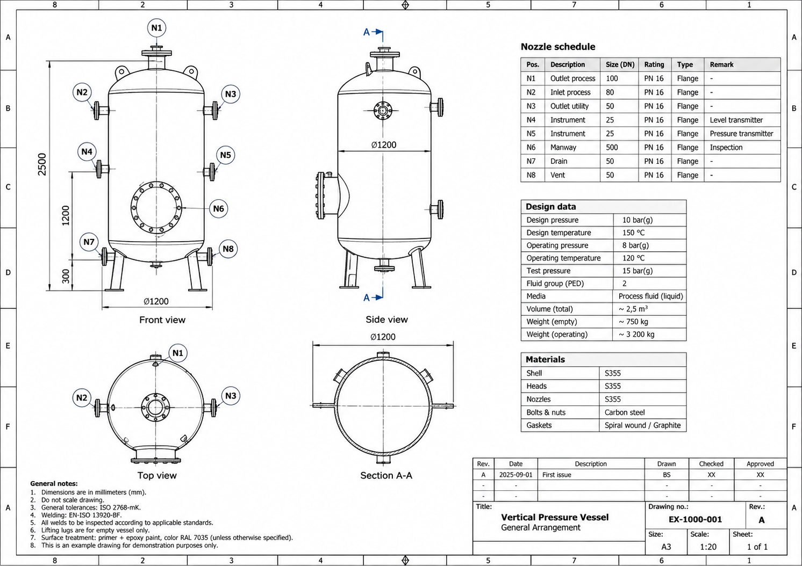

# AI Drawing Review Assistant

Building AI course project

## Summary

AI Drawing Review Assistant is a concept for using AI to support engineers when reviewing technical drawings. The system could identify possible errors, inconsistencies and missing information, helping engineers perform drawing reviews more efficiently and consistently.

## Background

Reviewing technical drawings is an important part of engineering projects. The review process can be time-consuming, especially in large projects where many drawings and revisions need to be checked.

During a drawing review, engineers may repeatedly encounter similar issues, such as:

* Missing or inconsistent information
* Differences between related drawings
* Incorrect or missing dimensions
* Deviations from project requirements
* Problems that have already been identified in previous drawings or projects

My motivation for this project comes from my own experience working with technical engineering drawings. A large amount of knowledge is created during previous projects and drawing reviews, but this knowledge is not always easy to reuse in future reviews.

The idea is therefore to investigate whether AI could assist the engineer by performing an initial review and highlighting areas that may require attention. The AI would not replace the engineer or make final engineering decisions.

## How is it used?

An engineer would provide a technical drawing to the AI Drawing Review Assistant. The system would analyse the drawing and compare the available information with relevant engineering data.

Possible reference information could include:

* Project requirements
* Previous review comments
* Similar approved drawings
* Engineering standards
* Related technical documents

The AI would then highlight possible problems or inconsistencies and present them as suggested review comments.

The engineer would review these suggestions and decide whether they are relevant. The final engineering decision would always remain with a qualified person.

## Data sources and AI methods

Possible data sources include technical drawings, previous drawing revisions, engineering specifications, previous review comments and other project documentation.

The solution could combine several AI methods:

* **Computer vision** to analyse graphical elements, symbols, dimensions and text in drawings.
* **Natural language processing** to analyse specifications, requirements and previous review comments.
* **Similarity search** to find comparable drawings and previously identified problems.
* **Machine learning** to identify recurring patterns in historical drawing reviews.

A practical solution could also combine AI with traditional rule-based engineering checks.

## Challenges

Engineering drawings contain complex technical information and the AI may not understand the complete engineering context. Incorrect suggestions could therefore create additional work or, more importantly, cause an actual problem to be overlooked.

Other challenges include data quality, confidentiality of engineering documents, differences between projects and standards, and access to sufficient historical data.

For these reasons, the AI Drawing Review Assistant should be considered a support tool rather than an automatic drawing approval system.

## What next?

The first prototype could focus on a limited part of the problem instead of trying to understand an entire engineering drawing.

For example, a prototype could use previous drawing review comments to find similar problems and suggest relevant historical comments to an engineer.

Future versions could add drawing analysis, automatic comparison between revisions, project-specific review checklists and connections between drawings, specifications and previous project knowledge.

The long-term goal would be an AI assistant that helps engineers reuse engineering knowledge and spend more time on complex engineering decisions.

## Prototype

Development of a first experimental prototype has started.

The prototype currently performs simple checks for common information in a technical drawing, such as:

* Drawing number
* Revision
* Date
* Drawing title

A fictional engineering drawing is included in this repository as a safe test case.

The goal is to gradually expand the prototype with more advanced drawing checks, comparison of drawing information and eventually AI-assisted review.

## Acknowledgments

This project was created as a final project for the Building AI course.

The project idea is inspired by practical experience with engineering drawing review and by the AI methods introduced during the Building AI course.
